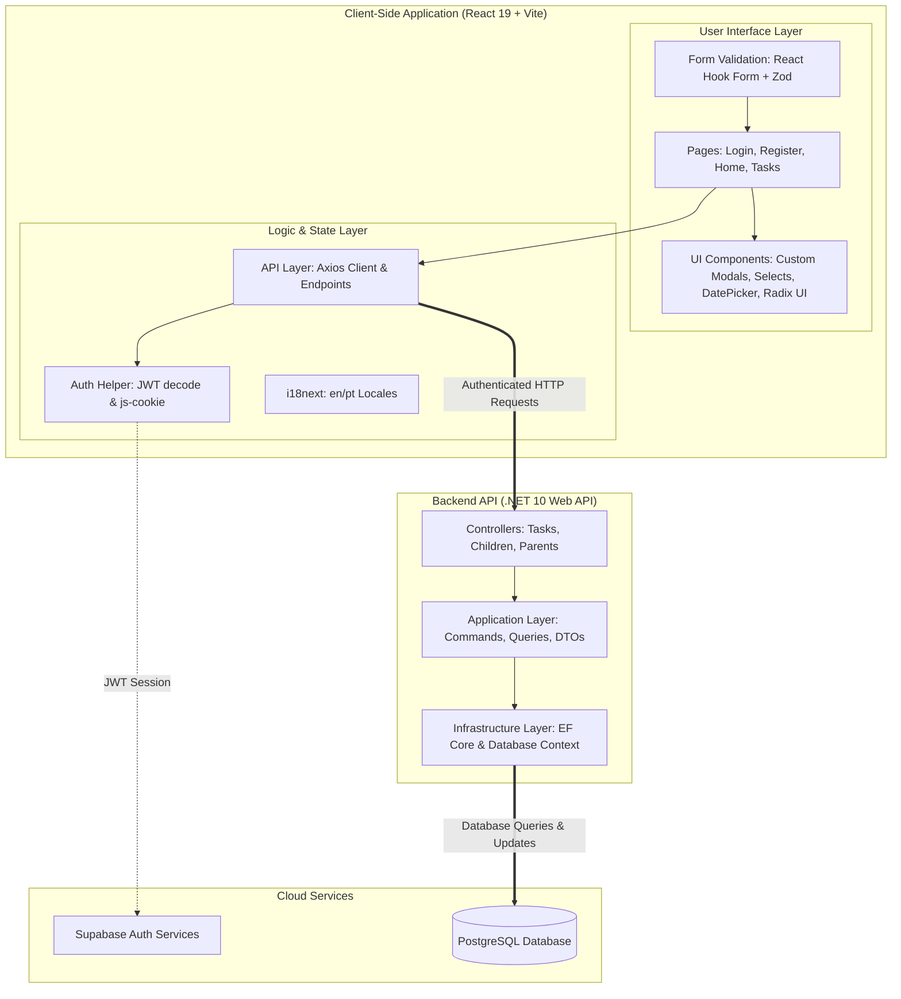

<p align="center">
  
</p>

<p align="center">
  
</p>

<h1 align="center">✨ WorthyCoins ✨</h1>

<p align="center">
  <strong>Transforming daily chores into valuable achievements! A gamified habit and task management platform for parents and children.</strong>
</p>

<p align="center">
  
  
  
  
  
  
</p>

---

## 🌟 About WorthyCoins

**WorthyCoins** is a modern, full-stack application designed to encourage responsibility, organization, and the development of positive habits in children and teenagers in a fun, interactive way.

Through a dynamic reward system, parents can create custom tasks (such as homework, making the bed, or brushing teeth) and set a reward value in **WorthyCoins** (virtual coins). As children complete tasks and parents approve them, coins accumulate in their digital piggy bank, promoting early financial literacy and daily gamification.

The project is split into two major components:
- 💻 **Web Client (`/web`):** A responsive React 19 single-page application built with TypeScript, Vite, and Radix UI.
- ⚙️ **Backend API (`/api`):** A high-performance Web API built using C# and .NET 10 with Entity Framework Core and PostgreSQL.

---

## 🚀 Key Features

### 📋 For Parents
- **Tailored Task Creation:** Define titles, detailed descriptions, due dates, and coin values.
- **Visual Customization:** Choose thematic colors and icons for each task using an interactive color picker and icon selector.
- **Child Management:** Set up individual profiles for each child to track their progress independently.
- **Advanced Filters & Search:** Search and filter tasks by child, status (pending, completed, overdue), due date, or sort them by urgency.

### 🪙 For Kids
- **Digital Piggy Bank:** Instant view of total accumulated coins.
- **Fun Achievements:** A clear sense of progress as coins are credited upon successfully completing responsibilities.
- **Friendly Interface:** Smooth design utilizing the rounded _Quicksand_ font, providing a delightful and accessible user experience for children.

---

## 🎨 Design & Visual Experience

Focused on high aesthetic quality and family/child usability, WorthyCoins features:
- ✨ **Harmonious & Dynamic Colors:** Soft blues, purples, and golden tones that inspire productivity and fun.
- 🧩 **Radix UI Components:** Fluid, high-performance custom popovers and selects.
- ⚡ **Skeleton Loaders:** Sleek loading animations with a shimmer effect while tasks are fetched.
- 🌏 **Multilingual Support (i18n):** Native localized translation switching between English and Portuguese based on the browser's language setting.

---

## 🛠️ System Architecture

WorthyCoins is designed with a modern, decoupled client-server architecture, utilizing a Single Page Application (SPA) frontend and a secure .NET 10 API backend layer.



---

## 💻 Tech Stack

### Web Frontend (`/web`)
* **React 19 & TypeScript 5.9:** Core UI library and type-safety.
* **Vite & Radix UI:** Ultra-fast bundling and accessible headless components.
* **i18next & Lucide React:** Localization engine and modern vector icons.
* **React Hook Form + Zod:** Dynamic schema validation and form handling.

### API Backend (`/api`)
* **.NET 10.0 Web API:** High-performance RESTful APIs.
* **C# 14:** Modern programming language.
* **Entity Framework (EF) Core:** Object-Relational Mapper (ORM) for Postgres.
* **PostgreSQL:** Reliable relational database.

---

## ⚙️ Running Locally

### 1. Backend Setup (`/api`)
Go to the API folder and run database migrations:
```bash
cd api
dotnet ef database update -p WorthyCoins.Infrastructure --startup-project WorthyCoins.API
dotnet run --project WorthyCoins.API
```

### 2. Frontend Setup (`/web`)
Create a `.env` file in `/web` (based on `/web/.env.example`):
```env
VITE_SUPABASE_URL=your_supabase_url_here
VITE_SUPABASE_ANON_KEY=your_supabase_anon_key_here
```
Install dependencies and run:
```bash
cd web
npm install
npm run dev
```

---

> [!IMPORTANT]
> Make sure to have the [.NET 10 SDK](https://dotnet.microsoft.com/download) and [Node.js](https://nodejs.org) installed on your system.

---
<p align="center">Made with ❤️ to inspire the next generation.</p>
